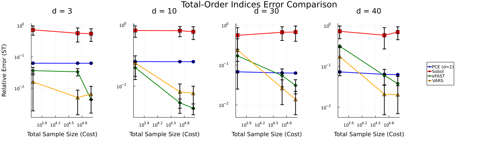

# VariogramAnalysis.jl

`VariogramAnalysis.jl` is a pure Julia implementation of the Variogram Analysis of Response Surfaces (VARS) method for global sensitivity analysis. This work is based on the original research by M. Razavi and H. V. Gupta and inspired by the Python implementation available at [vars-tool/vars-tool](https://github.com/vars-tool/vars-tool).

This package provides tools to:
*   Generate input parameter samples using efficient quasi-Monte Carlo methods (Sobol and Latin Hypercube).
*   Implement two different strategies for generating VARS "star" samples.
*   Calculate total-order sensitivity indices (ST).
*   Perform bootstrap analysis to estimate confidence intervals for the sensitivity indices.

## 💾 Installation

The package is registered in the official Julia General registry. You can install it by switching to the Pkg REPL (press `]` in the Julia REPL) and running:
```
pkg> add VariogramAnalysis
```

### Dependencies

This package's test suite validates its results against the Python library `varstool.py`. Upon installation, the necessary Python packages (including `varstool`, `numba`, `pandas`, etc.) will be automatically installed into a private Conda environment using `PyCall.jl`. No manual Python setup is required.

## 🚀 Performance and Use Cases

Global Sensitivity Analysis is not a one-size-fits-all problem. The performance of a given method depends heavily on the characteristics of the model being analyzed.

The VARS method, particularly with the `shifted_grid` sampling strategy implemented in this package, is exceptionally effective for models with **high-frequency, nonlinear, or interactive behavior**. It excels at detecting sensitivity in "rough" or complex response surfaces where traditional variance-based methods might struggle.

The plot below shows a comparison of GSA methods on the highly nonlinear Sobol-G function. As the dimensionality of the problem increases, `VariogramAnalysis.jl` (VARS, orange triangles) consistently provides the most accurate results for a given computational cost compared to other common methods.



For smoother, more additive models, classic variance-based methods like eFAST may be more efficient. We encourage users to consider their problem's characteristics when choosing a method.

## 📖 Usage Example: Sobol-G Function

Let's walk through an example using the Sobol-G function to understand the main workflow of `VariogramAnalysis.jl`.

First, bring the necessary packages into scope.
```julia
using VariogramAnalysis
using OrderedCollections
using Random
using Statistics
```

### 1. Define Your Model

You need a Julia function that represents your model. The function should take a vector of input parameters and return a single output value.

```julia
# Sobol-G function
function sobol_g_julia(x::AbstractVector, a::Vector)
    if length(x) != length(a)
        throw(ArgumentError("`x` must have exactly $(length(a)) arguments."))
    end
    result = 1.0
    for i in 1:length(x)
        result *= (abs(4 * x[i] - 2) + a[i]) / (1 + a[i])
    end
    return result
end
```

### 2. Define Input Parameters

Next, define the input parameters for your model using an `OrderedDict`. For each parameter, specify its distribution and range.

```julia
d = 4 # Number of dimensions
parameters_julia = OrderedDict("x$i" => (p1=0.0, p2=1.0, p3=nothing, dist="unif") for i in 1:d)
```

### 3. Sample the Input Space

Use the `VariogramAnalysis.sample` function to generate the input samples. For best performance, we recommend using the `sobol_shift` sampler and the `shifted_grid` ray logic.

```julia
N = 256             # Number of star centers
delta_h = 0.1       # Step size for radial sampling
seed = 123          # for reproducibility

problem = VariogramAnalysis.sample(parameters_julia, N, delta_h; 
                                   seed=seed, 
                                   sampler_type="sobol_shift", 
                                   ray_logic=:shifted_grid)
```

### 4. Run Your Model

Evaluate your model for each of the generated input samples.

```julia
a = [0, 0.5, 3, 9] # 'a' coefficients for the Sobol-G function
Y = [sobol_g_julia(x, a) for x in eachcol(problem.X)];
```

### 5. Perform Sensitivity Analysis

Now, you can perform the sensitivity analysis. For robust results, it's highly recommended to use bootstrapping to get confidence intervals on the sensitivity indices.

```julia
num_boot_replicates = 50 # Number of bootstrap replicates

# Define a closure for the analysis function
compute_st_closure = (Y_b, X_b, X_norm_b, info_b, N_b, d_b, delta_h_b) -> begin
    VariogramAnalysis.analyse(problem.method, X_b, X_norm_b, info_b, parameters_julia, N_b, d_b, delta_h_b, Y_b)
end

# Run the bootstrap analysis
julia_boot_results = VariogramAnalysis.VARSBootstrap.bootstrap_st!(
    compute_st_closure, Y, problem.X, problem.X_norm, problem.info,
    problem.N, problem.d, problem.delta_h;
    num_boot=num_boot_replicates, seed=seed
)```

### 6. View the Results

You can now analyze the results, for example, by calculating the mean of the bootstrapped sensitivity indices.

```julia
mean_st = mean(julia_boot_results.st_boot, dims=1)

println("Mean Total-Order Sensitivity Indices (ST):")
for i in 1:d
    println("  x$i: $(mean_st[i])")
end
```